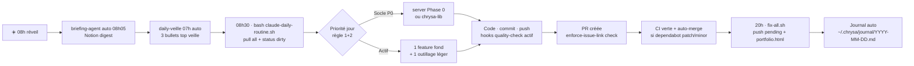
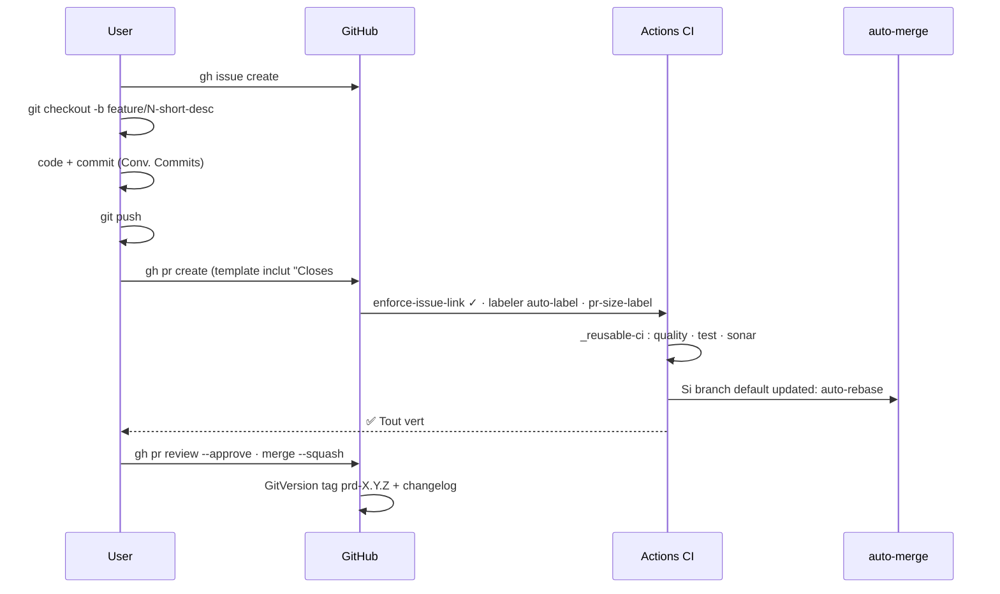
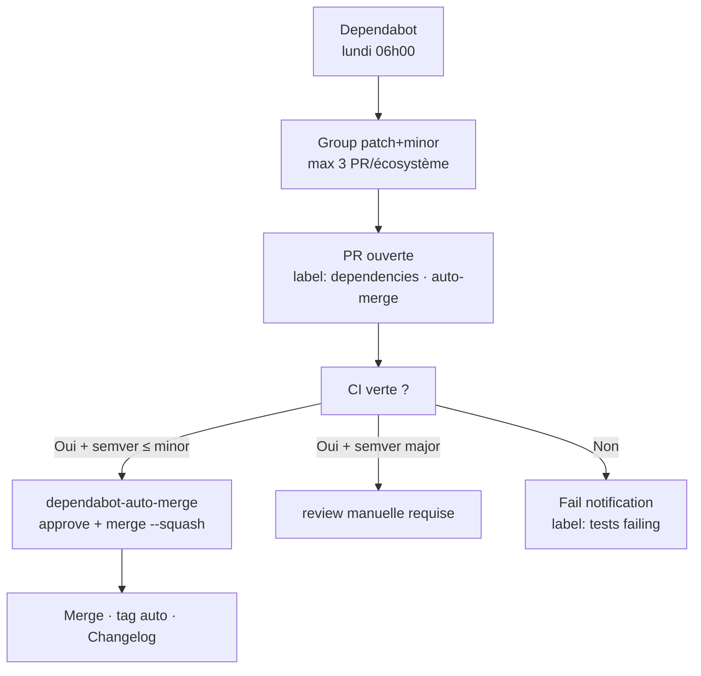
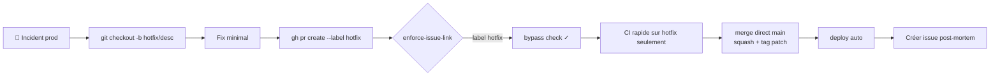
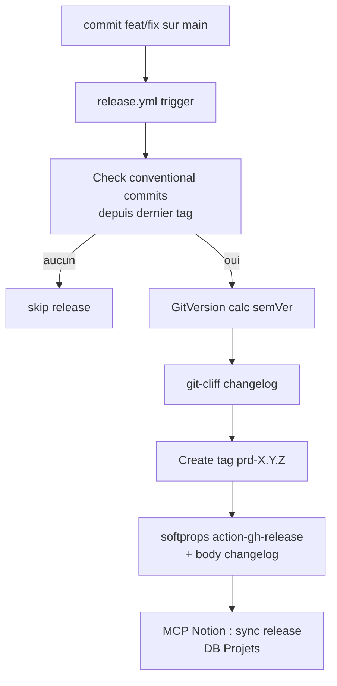
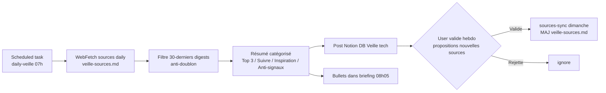
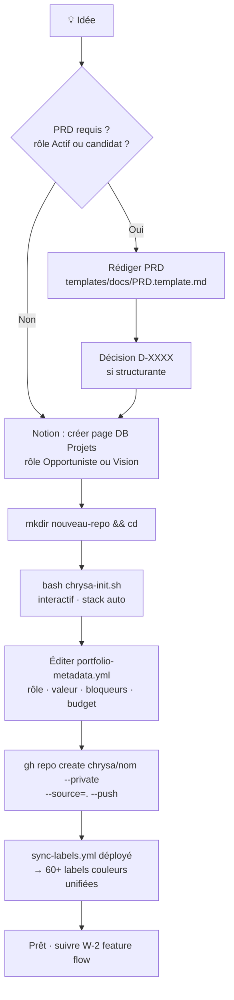
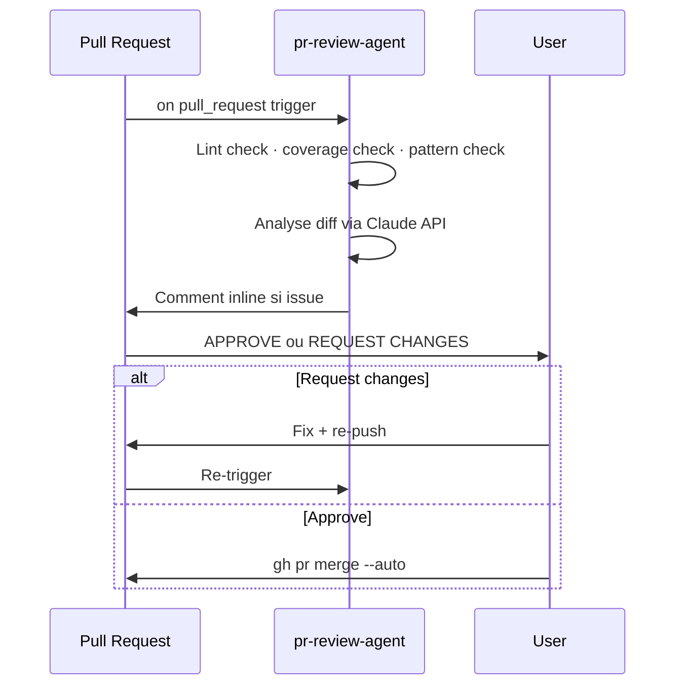
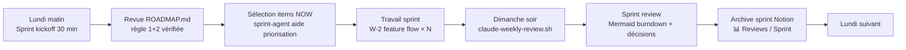
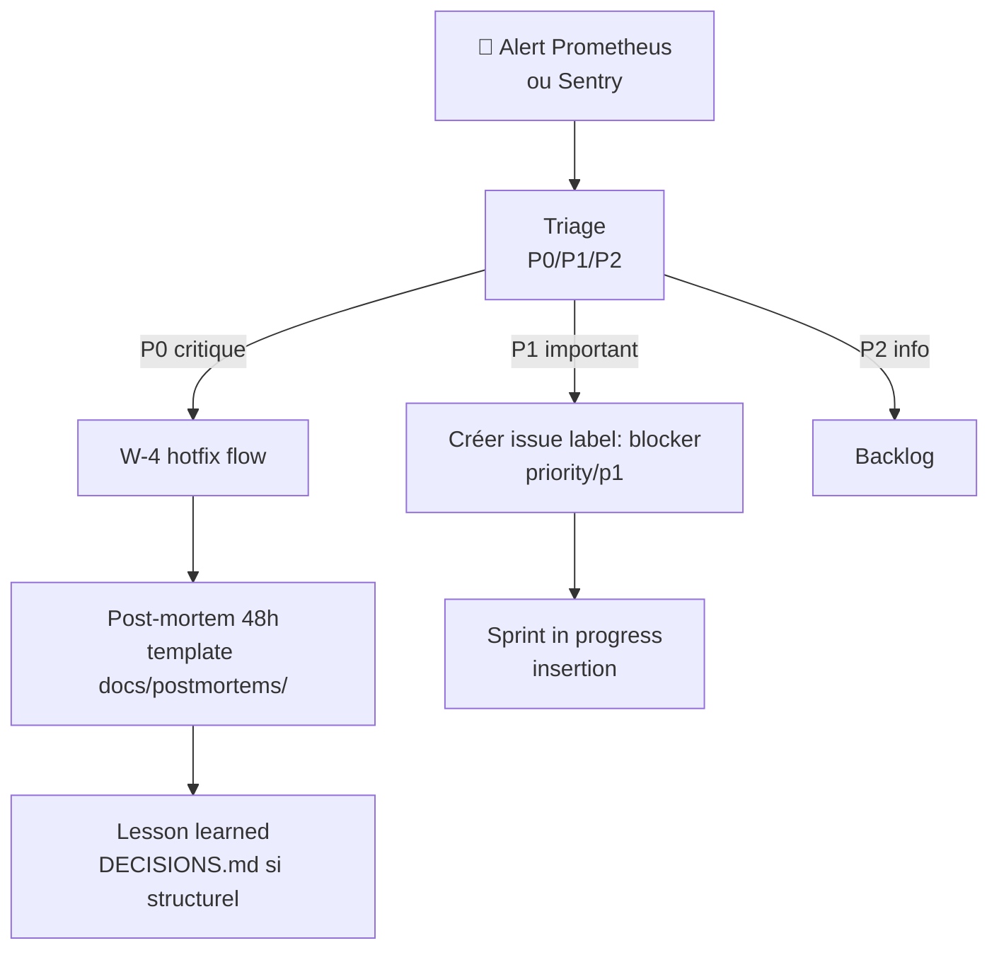

# Workflows opérationnels chrysa

> Workflows reproductibles · exploitent ce qui est installé (scripts, hooks, labels, agents).
> Source de vérité · publiés aussi en Notion Wiki Engineering.

---

## W-1 · Daily routine (08h → 20h)



**Commandes** :
```bash
bash shared-standards/scripts/claude-daily-routine.sh  # 08h30
# … code · commit · push pendant la journée …
bash shared-standards/scripts/fix-all.sh               # 20h, option --dry-run d'abord
```

**Agents impliqués** : `briefing-agent` · `daily-veille-technique` · `health-agent`

---

## W-2 · Feature flow (issue → PR → merge)



**Commandes** :
```bash
gh issue create --repo chrysa/REPO --title "..." --body "..." --label "priority/p1"
git checkout -b feature/123-short-desc
# ... travail ...
gh pr create --fill   # utilise le template avec Closes #123
# attendre CI verte
gh pr merge --auto --squash
```

**Workflows actifs** : `_reusable-ci.yml` · `enforce-issue-link.yml` · `labeler.yml` · `pr-size-label.yml` · `branch-auto-update.yml`

---

## W-3 · Dependabot cycle (auto-merge patch/minor)



**Config** : `.github/dependabot.yml` (rate-limité) + `dependabot-auto-merge.yml` (workflow)
**Budget CI** : ~5 min/mois par repo.

---

## W-4 · Hotfix urgent (bypass review)



**Règle** : label `hotfix` permet le bypass de la convention issue-link. Post-mortem obligatoire dans les 48h.

---

## W-5 · Release flow (GitVersion + changelog)



**Fixe issue #83** : voir `pre-commit-tools/ISSUE-83-DIAGNOSTIC.md`.

---

## W-6 · Veille technique journalière



**Sources** : `shared-standards/docs/veille-sources.md` (dev · domotique · jeux · automatisation).

---

## W-7 · Nouveau projet (idée → repo opérationnel)



**Commandes** :
```bash
mkdir mon-nouveau-repo && cd mon-nouveau-repo
bash $CHRYSA/shared-standards/scripts/chrysa-init.sh
# ... remplir les questions ...
gh repo create chrysa/mon-nouveau-repo --private --source=. --push
```

---

## W-8 · Code review (reviewer-agent)



**Agent** : `pr-review-agent` (GH Actions déclenché sur `pull_request`).

---

## W-9 · Sprint cycle (10h par sprint)



**Scripts** : `claude-weekly-review.sh` · `generate-roadmap-rollup.sh` · `health-agent`.

---

## W-10 · Incident response



**Runbook** : `server/docs/runbooks/incident-response.md` (à créer).

---

## Index Scripts / Hooks / Agents référencés

### Scripts
- `chrysa-init.sh` — bootstrap nouveau repo
- `apply-standards.sh` — distribuer templates
- `fix-all.sh` — pipeline 10 étapes
- `claude-daily-routine.sh` — routine matin
- `claude-weekly-review.sh` — dimanche soir
- `repos-push-pending.sh` — commit + push actifs
- `archive-obsolete-repos.sh` · `archive-merged-repos.sh` — ménage
- `generate-portfolio-html.sh --external` — partage externe
- `generate-roadmap-rollup.sh` · `generate-deps-graph.sh` · `generate-docs-index.sh`
- `audit-github-issues.sh` — stale closer
- `dev-run.sh` — runner app/test/lint
- `validate-prompt.py` — validateur prompt
- `generate-cross-project-issues.sh` — batch X-1 à X-11

### Workflows GitHub
- `_reusable-ci.yml` — CI unifiée Python+Node
- `dependabot-auto-merge.yml` — auto-merge patch/minor
- `branch-auto-update.yml` — rebase auto
- `enforce-issue-link.yml` — PR ↔ issue obligatoire
- `labeler.yml` · `sync-labels.yml` · `pr-size-label.yml`

### Agents / Scheduled tasks
- `briefing-agent` (08h) · `daily-veille-technique` (07h)
- `pr-review-agent` (on PR) · `sprint-agent` (manuel `/sprint`)
- `health-agent` (lundi 09h) · `notion-sync-agent` (daily)
- `pr-aging` · `ci-sweep` · `notion-comments-processor`
