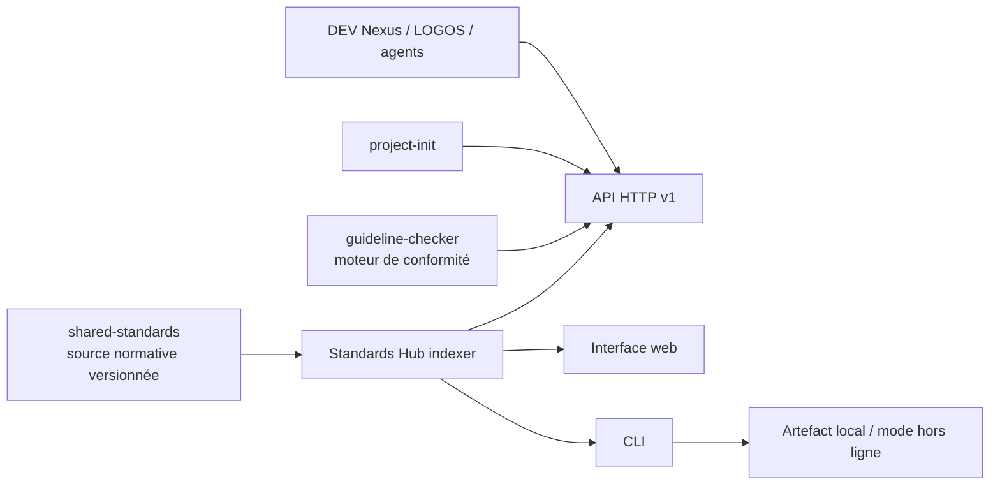

# Catalogue des standards

<callout icon="📚" color="blue_bg">
	**Positionnement canonique.** Standards Hub est une surface de consultation et d’intégration. Il ne possède aucune règle métier de standard et ne modifie pas directement les dépôts consommateurs.
</callout>
<table_of_contents/>
## Problème
Les standards sont aujourd’hui riches mais répartis entre documents Markdown, profils, templates, ADR, pages Notion et règles exécutables. Leur lecture directe dans Git convient aux mainteneurs, mais reste peu ergonomique pour :
- parcourir le catalogue et comprendre ce qui s’applique à un projet ;
- comparer deux versions ;
- retrouver une règle par sujet, langage, stack ou cible de déploiement ;
- permettre à LOGOS, DEV Nexus, project-init et aux agents de les consommer par contrat stable ;
- travailler hors ligne sans dépendre de Notion.
## Décision architecturale

### Frontières
- `shared-standards` publie les documents, métadonnées, profils et artefacts canoniques.
- Standards Hub indexe une **release immuable** ou un export local identifié par version et checksum.
- `guideline-checker` reste responsable de l’évaluation de conformité ; le Hub affiche ses résultats via contrat public facultatif.
- `project-init` peut interroger les profils, mais conserve son propre cycle de vie et son CLI.
- Aucun accès direct à la base ou au code interne d’un autre projet.
## Modèle de données minimal
### Standard
- `id`, `slug`, titre, résumé, contenu ;
- version, statut, propriétaire, dates ;
- catégories, tags, langages, stacks et cibles ;
- profils applicables ;
- contrôles automatisés associés ;
- remplace/remplacé par ;
- ADR, templates et exemples liés ;
- checksum et provenance Git.
### Profil
- identifiant et version ;
- héritage explicite ;
- type de produit, langage, rôle et cible de déploiement ;
- standards obligatoires, recommandés et non applicables ;
- exceptions et paramètres de gates.
### Résultat de conformité
- projet, commit et profil ;
- règle, sévérité, état, preuve et localisation ;
- baseline, exception et expiration ;
- version de guideline-checker.
## API V1
### Lecture publique ou authentifiée selon l’environnement
- `GET /v1/catalog`
- `GET /v1/standards`
- `GET /v1/standards/{id}`
- `GET /v1/standards/{id}/versions`
- `GET /v1/standards/{id}/diff?from=&to=`
- `GET /v1/profiles`
- `GET /v1/profiles/{id}`
- `POST /v1/profiles/resolve`
- `GET /v1/search?q=`
- `GET /v1/releases`
- `GET /v1/health`, `/v1/ready`, `/v1/version`
### Contrat
- OpenAPI canonique et SDK générables ;
- pagination par curseur ;
- ETag, cache et réponses conditionnelles ;
- format d’erreur transverse et identifiant de corrélation ;
- versionnement et politique de dépréciation ;
- export JSON, YAML et Markdown ;
- API read-only en V1.
## Interface web
### Vues principales
1. Catalogue global avec recherche et filtres.
2. Fiche standard avec statut, portée, contenu, exemples, gates et relations.
3. Explorateur de profils avec résolution interactive.
4. Comparateur de versions et changelog.
5. Matrice standards × profils × langages × cibles.
6. Tableau de conformité des projets lorsque guideline-checker est connecté.
### UX obligatoire
- Design Language chrysa et bibliothèque de composants partagée.
- FR/EN, thème clair/sombre et accessibilité WCAG AA minimum.
- Barre de chargement globale de page et loaders locaux.
- États vide, partiel, stale, hors ligne, erreur et accès refusé.
- Omnibar lorsque le catalogue dépasse dix entités navigables.
- Deep-links stables vers chaque standard, version, profil et résultat.
## CLI
Nom proposé : `standards` ou `chrysa-standards`.
### Commandes V1
```plain text
standards list
standards show STD-API-001
standards search "migration destructive"
standards profiles list
standards profiles resolve --language python --role api --target k3s
standards diff STD-API-001 --from v1.0.0 --to v1.1.0
standards export --profile python-api-k3s --format json
standards doctor
```
### Contrat CLI
- `--help`, `--version`, `--json`, `--quiet`, `--verbose`, `--offline` ;
- stdout réservé au résultat, stderr aux diagnostics ;
- codes de sortie documentés et stables ;
- complétion shell ;
- configuration dans `pyproject.toml` ou fichier utilisateur portable ;
- fonctionnement contre l’API ou un artefact local signé.
## Authentification et exposition
- Dans le cluster, SSO/OIDC obligatoire comme méthode principale.
- OAuth externe et compte local de secours restent possibles selon le standard d’authentification.
- Les rôles V1 sont simples : lecteur, mainteneur de l’index, administrateur technique.
- Toute exposition passe par Traefik ; aucun reverse proxy embarqué dans le conteneur.
- La consultation locale read-only doit fonctionner sans authentification et sans réseau.
## Stack proposée
- Backend : Python 3.14 + FastAPI, architecture ports/adapters.
- Frontend : React + TypeScript, TanStack Query et composants partagés.
- CLI : Typer, réutilisant le client API sans importer le backend.
- Index : SQLite ou PostgreSQL derrière un port ; index local reconstruisible depuis les artefacts.
- Recherche : FTS locale en V1 ; moteur externe uniquement après preuve du besoin.
- Déploiement : conteneurs séparés API, frontend et worker d’indexation si son cycle de vie le justifie.
## Synchronisation
- Ingestion déclenchée par release ou artefact, jamais par édition manuelle de la base.
- Vérification du schéma, signature/checksum et provenance avant activation.
- Construction d’un nouvel index puis bascule atomique.
- Conservation de la dernière version valide en cas d’échec.
- Historique des versions et rollback d’index.
- Notion peut être un connecteur d’enrichissement, jamais la source normative obligatoire.
## Observabilité et résilience
- OpenTelemetry pour logs, métriques et traces.
- Métriques : durée d’indexation, standards indexés, erreurs de schéma, fraîcheur, recherches, cache et latence API.
- Mode dégradé sur dernier index valide.
- Aucun échec d’indexation ne doit rendre le catalogue précédent indisponible.
- Runbook de reconstruction complète et sauvegarde de la configuration uniquement ; les données sont régénérables depuis les releases.
## Roadmap
### MVP
- schéma machine-readable ;
- import d’une release locale ;
- API read-only ;
- catalogue web, recherche et fiche standard ;
- CLI `list`, `show`, `search`, `profiles resolve` ;
- mode hors ligne.
### V1
- SSO, Traefik, historique et diff ;
- SDK générés ;
- intégration guideline-checker read-only ;
- matrice de conformité ;
- notifications de dépréciation.
### Plus tard
- propositions de changement avec génération de branche/PR dans `shared-standards`, toujours soumises à validation humaine ;
- assistant de compréhension des règles via `ai-aggregator` ;
- visualisation du graphe standards → profils → projets → gates.
## Hors scope V1
- édition directe des standards depuis l’interface ;
- remplacement de Git, de shared-standards ou de guideline-checker ;
- corrections automatiques silencieuses dans les dépôts ;
- stockage de secrets ou de données métier des projets.
## Risques
- seconde source de vérité : mitigée par un index entièrement reconstruisible et read-only ;
- sur-ingénierie : commencer par SQLite/FTS et une seule release ;
- dérive API/CLI/web : générer les clients depuis OpenAPI et partager les contrats, pas les internals ;
- catalogue riche mais inutilisé : mesurer recherches, profils résolus et consommateurs réels.
