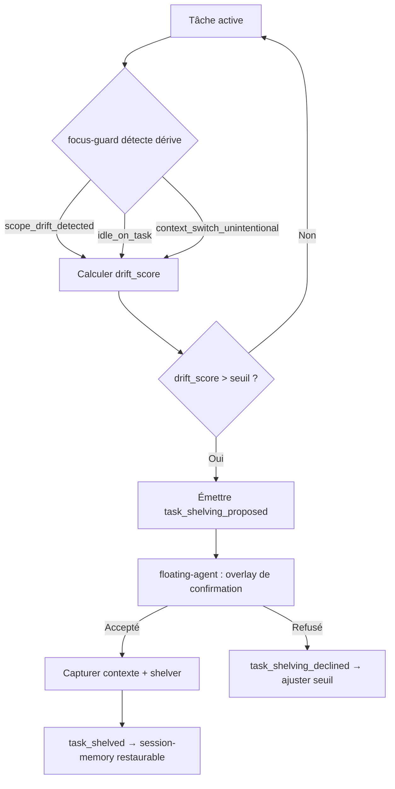
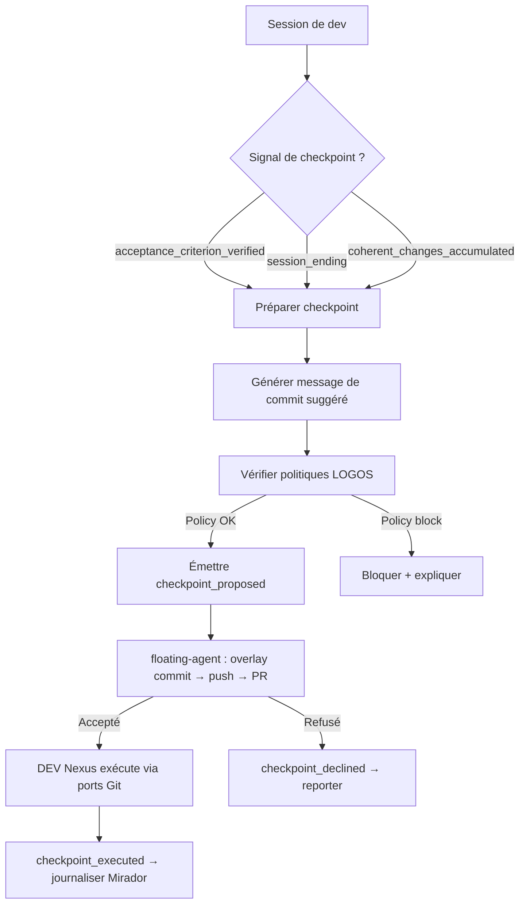

<callout icon="🎯" color="purple_bg">
	**Cadrage feature — Dev Focus Engine (DEV Nexus)**
	Le dev assistant doit proposer **proactivement** de (1) mettre de côté des tâches quand l'attention se disperse et (2) faire un checkpoint Git (commit → push → PR) au bon moment.
</callout>
## Problème
Un développeur solo gérant 70+ repos perd fréquemment du contexte en :<br>- accumulant des tâches en cours sans les shelver proprement → working tree sale, branches mortes, focus dilué ;<br>- oubliant de committer/pousser à la fin d'une session ou d'une tâche → travail non sauvegardé, PR en retard, CI en retard.
Le Dev Focus Engine gère déjà `active-task`, `focus-guard`, `session-memory`, `remaining-work` et `next-action` — mais en mode **réactif** (l'utilisateur doit demander). Ce cadrage ajoute la **proactivité** : le moteur propose au bon moment, l'utilisateur confirme.
## Périmètre
### Ce que la feature fait
1. **Shelving proactif de tâches** — Détecter quand la tâche active dérive (scope creep, switch de contexte non intentionnel, idle prolongé) et proposer de la shelver (mettre de côté avec contexte restaurable) plutôt que de la laisser en suspens.
2. **Checkpoint Git proactif** — Détecter les bons moments pour un checkpoint (tâche complétée, fin de session, avant shelver, accumulation de changements cohérents) et proposer commit → push → PR avec un message pré-généré.
### Ce que la feature ne fait pas
- ❌ Exécuter automatiquement (commit/push/PR sans confirmation explicite)
- ❌ Décider *quelle* tâche shelver (propose, l'utilisateur tranche)
- ❌ Fusionner automatiquement sur `main`
- ❌ Gérer les conflits Git (délègue à DEV Nexus execution layer)
- ❌ Porter les politiques de *quand* committer (règle LOGOS, ex. « pas de push après 23h »)
## Architecture
### Frontières canoniques
<table fit-page-width="true" header-row="true">
<tr>
<td>Composant</td>
<td>Rôle dans cette feature</td>
<td>Ne fait pas</td>
</tr>
<tr>
<td>**Dev Focus Engine** (DEV Nexus)</td>
<td>Détecte les signaux, produit les recommandations de shelving et de checkpoint, génère le message de commit proposé.</td>
<td>N'exécute pas Git directement — délègue à l'execution layer de DEV Nexus.</td>
</tr>
<tr>
<td>**DEV Nexus execution layer**</td>
<td>Exécute commit/push/PR après confirmation, via les ports Git déclarés. Journalise dans Mirador.</td>
<td>Ne décide pas *quand* proposer — ça vit dans Dev Focus.</td>
</tr>
<tr>
<td>**LOGOS**</td>
<td>Porte les **politiques** optionnelles (ex. « toujours valider les tests avant PR », « pas de push après 23h », « PR obligatoire si \> 5 commits non pushés »).</td>
<td>N'initie pas l'action Git — il fournit les guardrails, pas le déclencheur.</td>
</tr>
<tr>
<td>**floating-agent**</td>
<td>Affiche la proposition via le `DevFocusViewAdapter` (overlay desktop), collecte la confirmation utilisateur.</td>
<td>Ne porte pas la logique de détection ni d'exécution.</td>
</tr>
</table>
### Extension des capacités existantes
<table fit-page-width="true" header-row="true">
<tr>
<td>Capacité existante</td>
<td>Extension proactif</td>
<td>Signal de déclenchement</td>
</tr>
<tr>
<td>`focus-guard`</td>
<td>**Shelving proactif** — propose de shelver la tâche active quand une dérive est détectée.</td>
<td>`scope_drift_detected` (déjà émis) + nouveau signal `idle_on_task`  • `context_switch_unintentional`</td>
</tr>
<tr>
<td>`next-action`</td>
<td>**Checkpoint proactif** — propose commit → push → PR au bon moment.</td>
<td>`acceptance_criterion_verified` (déjà émis) + nouveau signal `session_ending`  • `coherent_changes_accumulated`</td>
</tr>
</table>
### Nouveaux signaux internes
```python
# Dev Focus Engine — nouveaux signaux de déclenchement

@dataclass
class IdleOnTask:
    """Tâche active sans événement de développement depuis N minutes."""
    task_id: str
    idle_minutes: int
    threshold: int  # configurable, défaut 30 min

@dataclass
class ContextSwitchUnintentional:
    """Changement de fichier/branche sans activation explicite d'une nouvelle tâche."""
    task_id: str
    expected_scope: list[str]  # périmètres autorisés
    actual_scope: list[str]    # fichiers/branches touchés
    drift_score: float  # 0.0 → 1.0

@dataclass
class SessionEnding:
    """Fin de session détectée (idle terminal, heure de fin habituelle, shutdown signal)."""
    trigger: str  # "idle_terminal" | "scheduled_end" | "shutdown"
    uncommitted_changes: bool
    unpushed_commits: int

@dataclass
class CoherentChangesAccumulated:
    """Accumulation de changements cohérents formant un checkpoint logique."""
    files_changed: int
    lines_changed: int
    semantic_coherence: float  # 0.0 → 1.0, via diff analysis
    suggested_commit_message: str
```
### Nouveaux événements émis
```python
# Extension du DevFocusEventPort

# Shelving
task_shelving_proposed   # « Cette tâche dérive — shelver ? »
task_shelved              # shelving confirmé par l'utilisateur
task_shelving_declined    # l'utilisateur a refusé

# Checkpoint Git
checkpoint_proposed       # « Bon moment pour commit → push → PR »
checkpoint_accepted        # l'utilisateur accepte le checkpoint
checkpoint_declined        # l'utilisateur refuse
checkpoint_executed        # commit/push/PR exécuté par DEV Nexus
```
### Flux shelving proactif

### Flux checkpoint Git proactif

## Contrat d'extension V0.1
### Extension du DevFocusCommandPort
```python
class DevFocusCommandPort(Protocol):
    # ... méthodes existantes ...

    # Nouvelles méthodes
    def shelve_task(self, command: ShelveTask) -> ShelvedTask:
        """Shelver la tâche active avec contexte restaurable."""
        ...

    def restore_task(self, command: RestoreTask) -> ActiveTask:
        """Restaurer une tâche précédemment shelvée."""
        ...

    def propose_checkpoint(self, command: ProposeCheckpoint) -> CheckpointProposal:
        """Générer une proposition de checkpoint Git (message + fichiers + branche suggérée)."""
        ...

    def accept_checkpoint(self, command: AcceptCheckpoint) -> CheckpointResult:
        """Confirmer et déléguer l'exécution à DEV Nexus."""
        ...
```
### Modèle de données étendu
```python
@dataclass
class ShelvedTask:
    id: str
    original_task_id: str
    shelved_at: datetime
    context_snapshot: str        # état complet pour restauration
    reason: str                 # "scope_drift" | "idle" | "context_switch" | "manual"
    drift_score: float
    restorable: bool = True

@dataclass
class CheckpointProposal:
    id: str
    task_id: str
    suggested_commit_message: str
    files_to_commit: list[str]
    suggested_branch: str | None  # None si déjà sur une branche de feature
    push_recommended: bool
    pr_recommended: bool
    pr_title: str | None
    policy_warnings: list[str]    # ex. ["Tests non passés", "Heure tardive"]
    confidence: float

@dataclass
class CheckpointResult:
    proposal_id: str
    commit_sha: str | None
    pushed: bool
    pr_url: str | None
    mirador_trace_id: str
```
### Manifeste étendu
```yaml
module:
  id: dev-focus
  version: 0.2.0
  contract_version: v0.1
  optional: true
  owner: dev-nexus

capabilities:
  - active-task
  - focus-guard
  - session-memory
  - remaining-work
  - next-action
  # Nouveaux
  - proactive-shelving
  - proactive-checkpoint

permissions:
  git:
    read_status: true       # déjà existant
    read_diff: true         # nouveau — lecture du diff pour générer le message
    modify_repository: false # inchangé — l'exécution reste chez DEV Nexus

optional_adapters:
  - ollama                  # pour la génération de message de commit
  - dev-nexus               # pour l'exécution du checkpoint
  - vscode
```
## Configuration
<table fit-page-width="true" header-row="true">
<tr>
<td>Paramètre</td>
<td>Défaut</td>
<td>Description</td>
</tr>
<tr>
<td>`shelving.idle_threshold_min`</td>
<td>30</td>
<td>Minutes d'inactivité avant proposition de shelving.</td>
</tr>
<tr>
<td>`shelving.drift_threshold`</td>
<td>0.6</td>
<td>Score de dérive au-dessus duquel le shelving est proposé.</td>
</tr>
<tr>
<td>`shelving.max_shelved_tasks`</td>
<td>5</td>
<td>Limite de tâches shelvées simultanées (anti-accumulation).</td>
</tr>
<tr>
<td>`checkpoint.coherent_min_files`</td>
<td>3</td>
<td>Minimum de fichiers cohérents pour proposer un checkpoint.</td>
</tr>
<tr>
<td>`checkpoint.session_end_grace_min`</td>
<td>10</td>
<td>Minutes de grâce avant de proposer un checkpoint de fin de session.</td>
</tr>
<tr>
<td>`checkpoint.max_unpushed_commits`</td>
<td>5</td>
<td>Au-delà, un checkpoint devient obligatoire (warning → proposition forcée).</td>
</tr>
<tr>
<td>`checkpoint.generate_message_with_llm`</td>
<td>false</td>
<td>Utiliser Ollama pour générer le message de commit (sinon, template déterministe).</td>
</tr>
</table>
## Politiques LOGOS optionnelles
Les politiques sont des guardrails que LOGOS peut injecter via le Capability Registry. Dev Focus les consulte avant de proposer un checkpoint :
```yaml
policies:
  - id: no-push-after-hours
    rule: "current_hour >= 23 → block push, allow commit only"
    
  - id: tests-before-pr
    rule: "last_test_run != green → block PR, allow commit+push"
    
  - id: max-unpushed-warning
    rule: "unpushed_commits > 5 → force checkpoint proposal"
    
  - id: clean-tree-before-shelve
    rule: "working_tree_dirty → propose checkpoint before shelving"
```
## UX intégrée (floating-agent)
Aucun nouvel onglet. Deux nouveaux blocs transitoires s'ajoutent aux quatre existants :
```plain text
TÂCHE ACTIVE
ÉTAPE ACTUELLE
ALERTES DE FOCUS
  └─ 📦 Cette tâche dérive — shelver ? [Shelver] [Garder]
PROCHAINE ACTION
  └─ 🔖 Bon moment pour commit → push → PR [Voir] [Plus tard]
```
- Les propositions sont **non-bloquantes** (l'utilisateur peut les ignorer).
- Une proposition ignorée N+1 fois ajuste son seuil (anti-bruit).
- Le shelving capture un snapshot restaurable (fichiers, branche, critères d'acceptation, événements).
- Le checkpoint affiche le diff summary + message proposé + avertissements de politique.
## Dépendances
- **Dev Focus Engine V0.1** (domaine + ports V0) — prérequis, déjà cadré.
- **DEV Nexus execution layer** — ports Git pour commit/push/PR (déjà partiellement implémenté via S4 one-click execution).
- **LOGOS Capability Registry** — pour injecter les politiques optionnelles.
- **floating-agent DevFocusViewAdapter** — pour le rendu overlay.
- **ai-aggregator / Ollama** (optionnel) — pour la génération de message de commit.
## Kill tests
La feature doit être recadrée ou abandonnée si :
- les propositions de shelving sont ignorées \> 80 % du temps sur 30 jours de dev réel → bruit, pas valeur.
- les propositions de checkpoint sont ignorées \> 70 % du temps → l'utilisateur commite déjà au bon moment seul.
- le shelving ne restaure pas correctement le contexte dans \> 20 % des cas → confiance rompue.
- les messages de commit générés sont modifiés systématiquement (\> 90 %) → la génération n'apporte rien.
- la feature augmente les interruptions au lieu de les réduire (mesure via le budget d'attention).
- un second consommateur de shelving/checkpoint n'apparaît pas dans les 90 jours → évaluer l'extraction.
## Roadmap
<table fit-page-width="true" header-row="true">
<tr>
<td>Phase</td>
<td>Contenu</td>
<td>Dépend de</td>
</tr>
<tr>
<td>**Phase A — Shelving déterministe**</td>
<td>Shelving proactif sur `scope_drift_detected`  • `idle_on_task` uniquement. Pas de LLM. Restauration manuelle.</td>
<td>Dev Focus V0.1 (domaine + ports)</td>
</tr>
<tr>
<td>**Phase B — Checkpoint déterministe**</td>
<td>Checkpoint sur `acceptance_criterion_verified`  • `session_ending`. Message de commit par template (pas de LLM). Push + PR via DEV Nexus.</td>
<td>Phase A + DEV Nexus ports Git</td>
</tr>
<tr>
<td>**Phase C — Politiques LOGOS**</td>
<td>Injection des guardrails (no-push-after-hours, tests-before-pr, etc.). Ajustement des seuils anti-bruit.</td>
<td>Phase B + LOGOS Capability Registry</td>
</tr>
<tr>
<td>**Phase D — Enrichissement LLM**</td>
<td>Génération de message de commit via Ollama. Analyse de cohérence sémantique des changements. `coherent_changes_accumulated`.</td>
<td>Phase C + Ollama adapter</td>
</tr>
</table>
## Références
- [ADR-DEVFOCUS-001 — Dev Focus comme capacité de DEV Nexus](https://app.notion.com/p/3a659293e35e81868c30d3923deff621)
- [DEV Nexus → AI Coding Assistant / Dev Focus Engine](https://app.notion.com/p/3a659293e35e819c8a2bdf577be999b8)
- [DEV Nexus — page principale](https://app.notion.com/p/34159293e35e811dbba2ed171d7a7e7d)
- [floating-agent](https://app.notion.com/p/37959293e35e810185f2dbea0cfdb935) — surface desktop/edge
- [LOGOS](https://app.notion.com/p/35759293e35e81d18fb1fc0b34473321) — politiques et guardrails
- [Orca — Agent Development Environment](https://app.notion.com/p/3a659293e35e81dbb126d2edc47bd10e) — exécution isolée
- [Benchmark Mark-L — pipeline obligatoire](https://app.notion.com/p/3a659293e35e81acaf6fecefc85ad61f) — règles d'exécution gouvernée
---
<callout icon="⚠️" color="gray_bg">
	**Statut : cadrage initial — 29 juillet 2026.** À valider avant implémentation. Les phases A et B peuvent démarrer dès que Dev Focus V0.1 (domaine + ports) est stabilisé.
</callout>
