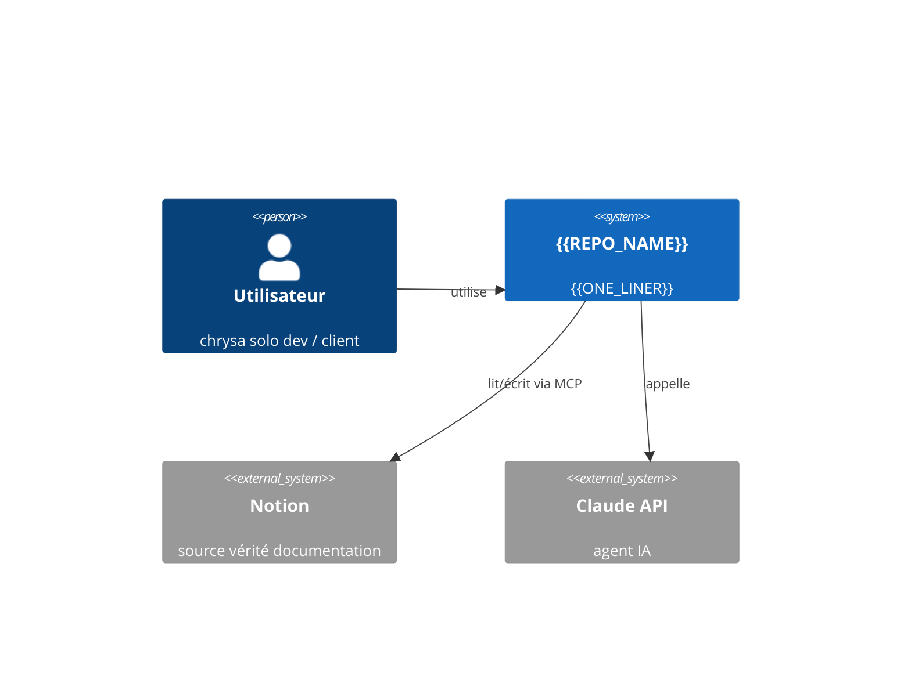
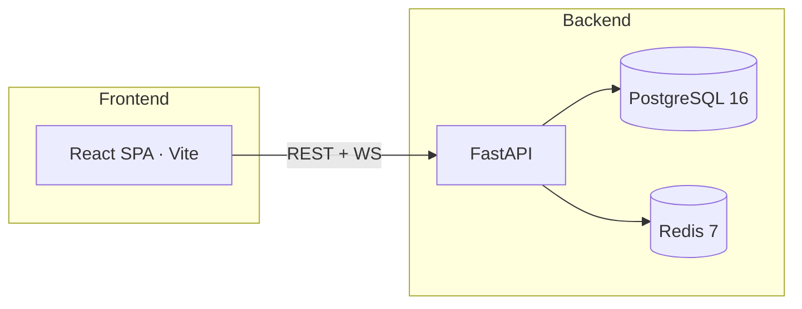
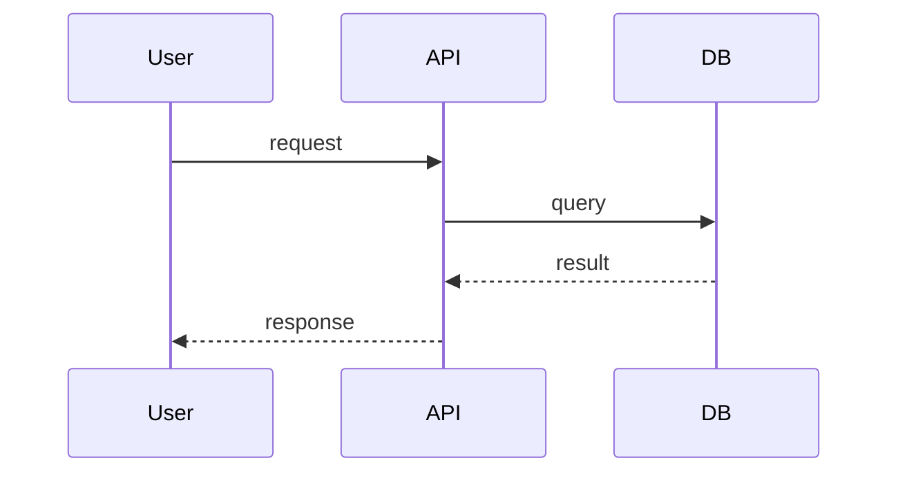

# ARCHITECTURE — {{REPO_NAME}}

> Vue architecturale statique · à mettre à jour avant tout PR impactant la structure

---

## Contexte système (C4 · niveau 1)



## Conteneurs (C4 niveau 2)



## Composants internes majeurs

| Composant | Rôle | Stack |
| --------- | ---- | ----- |
| | | |

## Flows critiques

### Flow 1 — {{nom}}



## Modèle de données (principal)

Voir `docs/db-schema.dbml` ou Alembic migrations pour la source vérité.

## Intégrations externes

| Service | Direction | Protocole | Auth |
| ------- | --------- | --------- | ---- |
| | | | |

## Non-fonctionnels

- **Perf** : p95 < {{Xms}} sur endpoint critique
- **Scale** : {{N}} RPS cibles
- **Sécurité** : auth 4 modes (chrysa-lib) · secrets via Vault/env · CSP stricte
- **Observabilité** : Prometheus métriques + Loki logs + Sentry erreurs
- **Accessibilité** : WCAG 2.1 AA
- **i18n** : FR + EN dès V1

## Décisions architecturales

Voir `DECISIONS.md` (numérotation D-XXXX locale).

## Dépendances repos chrysa

```mermaid
graph LR
  this[{{REPO_NAME}}] --> chrysa-lib
  this --> shared-standards
```

## Dette technique connue

Voir `docs/TECH_DEBT.md` si présent, sinon section "🔴 À refactorer" du README.
